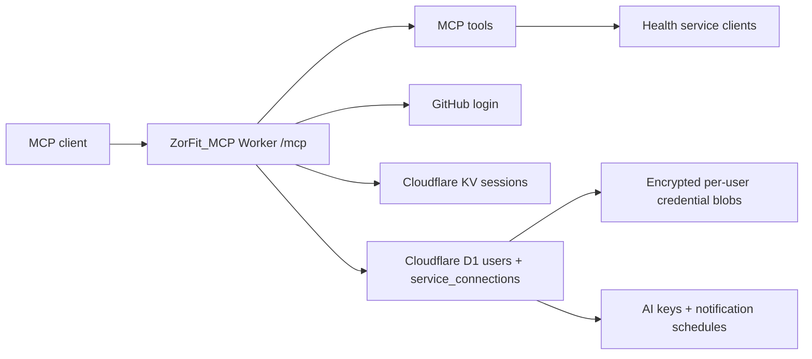

# ZorFit_MCP

ZorFit_MCP is a production-ready remote [Model Context Protocol](https://modelcontextprotocol.io/) server for personal health, fitness, training, nutrition, and wearable data.

It exposes one `/mcp` endpoint while each signed-in user connects their own services from `/connections`.

## Integrations

- **Hevy**: workouts, routines, exercise templates, routine folders, workout events
- **Strava**: athlete profile, recent activities, segment starring
- **Cronometer**: diary, nutrition, food search, custom foods, fasting, macro targets
- **Intervals.icu**: athlete profile, activities, wellness, events, gear, sport settings
- **Fitbit**: profile, activity summaries, sleep, body weight, heart rate
- **Google Fit**: data sources, activity aggregates, body aggregates, heart aggregates, sleep aggregates
- **AI providers**: user-supplied OpenAI, Claude, Gemini, NVIDIA NIM, OpenRouter, Groq, or Google AI Studio keys for future insight generation
- **Telegram**: optional nutrition insight push channel with user-configurable delivery times

## Architecture



## Security Model

- No real API keys or tokens are committed.
- GitHub identifies the user.
- Cloudflare KV stores OAuth/session state.
- Cloudflare D1 stores users and service connection metadata.
- Service credentials are AES-GCM encrypted before being stored in D1.
- User LLM API keys are also AES-GCM encrypted before being stored in D1.
- Each user manages credentials from `/connections`.
- Each user can configure their own Telegram nutrition push times from `/settings/messages`.
- Existing FitnessMCP Cloudflare resources are not reused. Create new KV and D1 resources for this project.

## Beginner Setup

### 1. Install tools

Install:

- Node.js
- Git
- A Cloudflare account
- A GitHub account

Check:

```bash
node --version
git --version
```

### 2. Clone

```bash
git clone https://github.com/senoj100-alt/ZorFit_MCP.git
cd ZorFit_MCP
npm install
```

### 3. Log in to Cloudflare

```bash
npx wrangler login
```

### 4. Create new Cloudflare resources

Do not use existing FitnessMCP resources.

Create a new KV namespace:

```bash
npx wrangler kv namespace create OAUTH_KV
```

Create a new D1 database:

```bash
npx wrangler d1 create zorfit_mcp
```

Put the returned IDs into `wrangler.jsonc`:

```txt
REPLACE_WITH_YOUR_PRODUCTION_KV_NAMESPACE_ID
REPLACE_WITH_YOUR_PRODUCTION_D1_DATABASE_ID
```

For dev, either reuse those IDs or create dev-only resources:

```bash
npx wrangler kv namespace create OAUTH_KV --env dev
npx wrangler d1 create zorfit_mcp_dev
```

### 5. Apply the D1 schema

```bash
npx wrangler d1 migrations apply zorfit_mcp
```

For dev:

```bash
npx wrangler d1 migrations apply zorfit_mcp_dev --env dev
```

### 6. Create a GitHub OAuth app

For local development:

```txt
Application name: ZorFit_MCP Local
Homepage URL: http://localhost:8787
Authorization callback URL: http://localhost:8787/callback
```

For production, create a second OAuth app:

```txt
Application name: ZorFit_MCP
Homepage URL: https://zorfit.YOUR_SUBDOMAIN.workers.dev
Authorization callback URL: https://zorfit.YOUR_SUBDOMAIN.workers.dev/callback
```

### 7. Configure local secrets

```bash
cp .dev.vars.example .dev.vars
openssl rand -hex 32
```

Fill in:

```txt
GITHUB_CLIENT_ID=...
GITHUB_CLIENT_SECRET=...
GOOGLE_LOGIN_CLIENT_ID=...
GOOGLE_LOGIN_CLIENT_SECRET=...
COOKIE_ENCRYPTION_KEY=...
```

Google login is optional. If you enable it, create a Google OAuth web client and add these redirect URIs:

```txt
http://localhost:8787/auth/google/callback
https://your-production-domain.example/auth/google/callback
```

Optional OAuth app credentials for provider connect buttons:

```txt
FITBIT_CLIENT_ID=...
FITBIT_CLIENT_SECRET=...
GOOGLE_FIT_CLIENT_ID=...
GOOGLE_FIT_CLIENT_SECRET=...
```

Users can also paste service credentials manually in `/connections`.

Optional Telegram settings for nutrition pushes:

```txt
TELEGRAM_BOT_TOKEN=...
TELEGRAM_BOT_USERNAME=...
TELEGRAM_WEBHOOK_SECRET=...
```

Create the bot in Telegram with BotFather. Use the bot username without the `@` symbol.

### 8. Run locally

```bash
npm run dev
```

Open:

```txt
http://localhost:8787
http://localhost:8787/connections
http://localhost:8787/health
```

### 9. Set production secrets

Run only for the new `zorfit` Worker:

```bash
npx wrangler secret put GITHUB_CLIENT_ID
npx wrangler secret put GITHUB_CLIENT_SECRET
npx wrangler secret put GOOGLE_LOGIN_CLIENT_ID
npx wrangler secret put GOOGLE_LOGIN_CLIENT_SECRET
npx wrangler secret put COOKIE_ENCRYPTION_KEY
npx wrangler secret put FITBIT_CLIENT_ID
npx wrangler secret put FITBIT_CLIENT_SECRET
npx wrangler secret put GOOGLE_FIT_CLIENT_ID
npx wrangler secret put GOOGLE_FIT_CLIENT_SECRET
npx wrangler secret put TELEGRAM_BOT_TOKEN
npx wrangler secret put TELEGRAM_BOT_USERNAME
npx wrangler secret put TELEGRAM_WEBHOOK_SECRET
```

### 10. Deploy

```bash
npm run deploy
```

Your MCP endpoint will be:

```txt
https://zorfit.YOUR_SUBDOMAIN.workers.dev/mcp
```

## Settings, AI Keys, and Telegram Pushes

Open:

```txt
https://zorfit.YOUR_SUBDOMAIN.workers.dev/settings
```

The settings area is split into three categories:

- **Fitness Apps & Wearables**: service credentials and live connection status
- **AI Connections**: bring-your-own-key LLM setup
- **Messages**: Telegram linking and nutrition insight schedules

AI provider pages include guidance for model names. For example, NVIDIA NIM model IDs often look like `meta/llama-3.1-70b-instruct` or `qwen/qwen2.5-coder-32b-instruct`; OpenRouter model IDs often include a provider prefix such as `openai/gpt-4o-mini`.

After a user connects one or more AI providers, they can choose a default model from `/settings/ai`. Telegram nutrition pushes use that default model first, then fall back to another enabled provider if no default is saved.

Telegram pushes are dynamic per user. Cloudflare runs one Worker cron every 15 minutes, then ZorFit checks D1 for users whose configured local times are due. This avoids one cron job per user and scales more cleanly.

Users can add optional Telegram insight instructions such as "focus on protein and fiber" or "keep messages short." These instructions guide style and focus only. ZorFit always appends a safety footer: "Not medical advice. Consult a qualified professional for health or nutrition decisions."

The Telegram webhook endpoint is:

```txt
https://zorfit.YOUR_SUBDOMAIN.workers.dev/api/telegram/webhook
```

When setting the webhook with Telegram, pass the same secret you stored as `TELEGRAM_WEBHOOK_SECRET`.

## MCP Client Config

```json
{
  "mcpServers": {
    "zorfit": {
      "command": "npx",
      "args": [
        "mcp-remote",
        "https://zorfit.YOUR_SUBDOMAIN.workers.dev/mcp"
      ]
    }
  }
}
```

## Tool Examples

```txt
fitness_get_connected_services
fitbit_get_profile
fitbit_get_activity_summary
fitbit_get_sleep
fitbit_get_body_weight
fitbit_get_heart_rate
google_fit_list_data_sources
google_fit_get_activity_summary
google_fit_get_body_summary
google_fit_get_heart_summary
google_fit_get_sleep_summary
strava_get_recent_activities
cronometer_get_daily_nutrition
intervals_get_wellness
get_workouts
```

## Development

```bash
npm run dev
npm run type-check
npm run test:run
npm run lint
npm run check
```

## Project Structure

```txt
src/
  mcp-agent.ts
  github-handler.ts
  lib/
    service-connections.ts
    service-registry.ts
    fitbit-client.ts
    google-fit-client.ts
    strava-client.ts
    cronometer-client.ts
    intervals-client.ts
migrations/
  0001_service_connections.sql
wrangler.jsonc
.dev.vars.example
```

## Production Checklist

- New Cloudflare Worker name: `zorfit`
- New KV namespace for ZorFit_MCP
- New D1 database for ZorFit_MCP
- D1 migration applied
- GitHub OAuth app callback points to this Worker
- Fitbit and Google OAuth app callbacks point to `/connect/fitbit/callback` and `/connect/google_fit/callback`
- `/connections` works for the signed-in user
- `npm run check` passes
- No `.dev.vars`, `.env`, tokens, passwords, or IDs committed

## License

MIT
